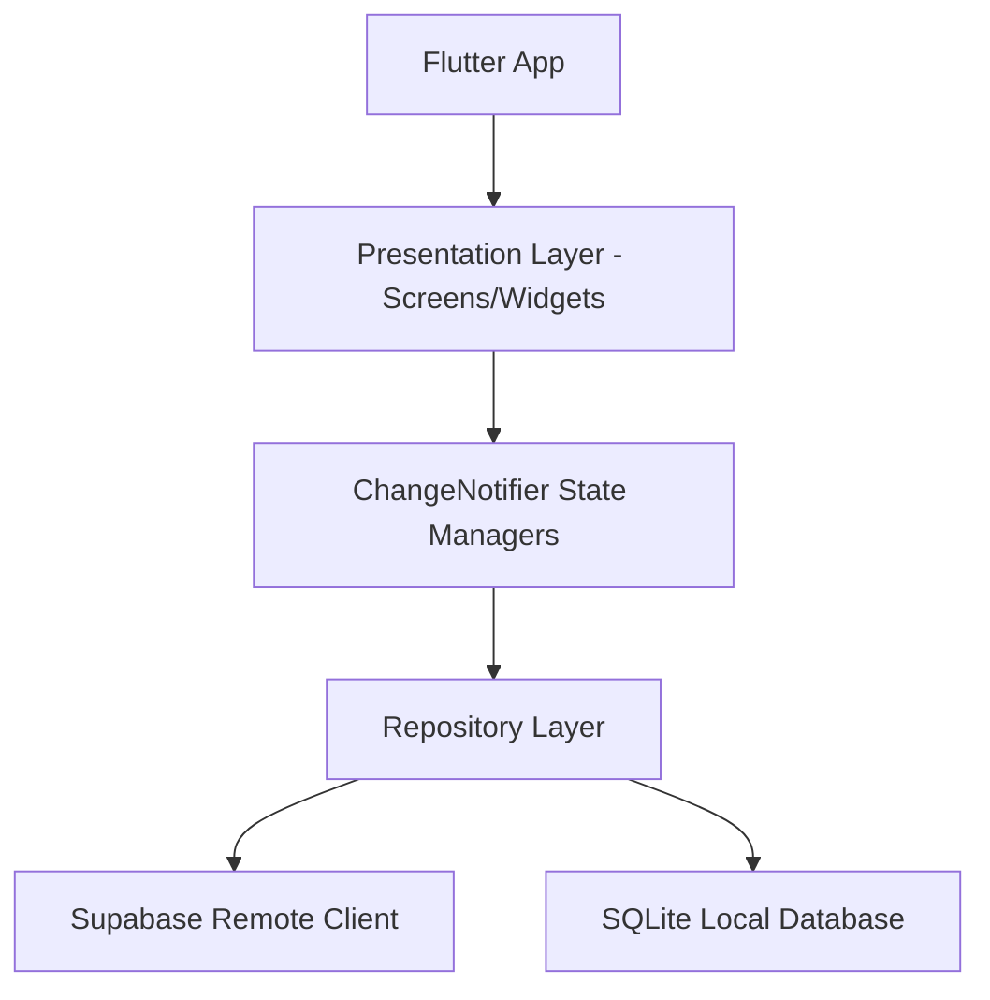

# DESIGN.md - Buss App (Zenith / BusGo Transit)

This design document outlines the structure, styling, architecture, database schemas, and integration plans for **Buss App** (recreated from Zenith Transit & BusGo designs).

## Overview

The Buss App is a modern public and private transportation utility app built with Flutter. It implements the **Modern Minimalist / Achromatic Glassmorphic** styling exported from the design specs, leveraging pure black for focus elements, soft grey/white elevations for container layers, and a responsive structure.

The app supports:
1. **Inicio (Home / Explore Trips):** A welcoming feed displaying featured bus trips (e.g., NILDOWS, City Coach), categories, and location search.
2. **Mapa (Map & Stations):** An interactive-style map display showing location markers and a list of nearby stations with live-tracking timers.
3. **Autobuses (Units & Contact):** A directory showing active public transport buses, details (capacities, routes, operating hours), and direct WhatsApp contact actions.
4. **Transporte Privado (Private Bookings):** An executive request form to book private vans, including local/cloud storage database records.

---

## Architecture & Directory Structure

The application follows a **Clean Feature-First Architecture** to isolate components, logic, and state management.

```
lib/
├── main.dart                      # App entry point, SDK initializations
├── core/
│   ├── theme/
│   │   └── app_theme.dart         # Monochromatic/Achromatic styles, Fonts (Plus Jakarta Sans)
│   ├── database/
│   │   └── local_database.dart    # SQLite helper (sqflite)
│   ├── api/
│   │   └── supabase_client.dart   # Supabase backend adapter
│   └── widgets/
│       ├── custom_button.dart     # Independent reusable widgets (Primary, Secondary, Contact)
│       ├── custom_text_field.dart # Reusable rounded input fields
│       └── bottom_nav_bar.dart    # Translucent floating navigation pill
└── features/
    ├── home/
    │   ├── data/
    │   │   └── trip_model.dart
    │   └── presentation/
    │       ├── home_screen.dart
    │       └── widgets/
    │           └── trip_card.dart
    ├── map/
    │   ├── data/
    │   │   └── station_model.dart
    │   └── presentation/
    │       ├── map_screen.dart
    │       └── widgets/
    │           └── station_card.dart
    ├── buses/
    │   ├── data/
    │   │   └── bus_model.dart
    │   └── presentation/
    │       ├── buses_screen.dart
    │       └── widgets/
    │           └── bus_unit_card.dart
    └── private_transport/
        ├── data/
        │   └── booking_model.dart
        └── presentation/
            ├── private_transport_screen.dart
            └── widgets/
                └── booking_form.dart
```

---

## Database Schemas

To provide full local offline access (SQLite) synced with a remote database (Supabase), the schema covers three core entities:

### 1. Stations (Nearby stations for the Map view)
* **Table:** `stations`
* **Fields:**
  * `id` TEXT PRIMARY KEY (UUID / Code)
  * `name` TEXT (e.g., "Central Station")
  * `address` TEXT (e.g., "422 Grand Ave, Downtown")
  * `distance` REAL (in km, e.g., 0.4)
  * `next_route` TEXT (e.g., "Route 42")
  * `next_time_mins` INTEGER (minutes remaining, e.g., 3)

### 2. Buses (Bus units with contact details)
* **Table:** `buses`
* **Fields:**
  * `id` TEXT PRIMARY KEY
  * `number` TEXT (e.g., "#42")
  * `model` TEXT (e.g., "Mercedes-Benz Sprinter 2024")
  * `capacity` INTEGER (passengers, e.g., 18)
  * `operating_hours` TEXT (e.g., "06:00 AM - 10:00 PM")
  * `current_location` TEXT (e.g., "Terminal Central del Norte")
  * `phone_number` TEXT (e.g., "+1234567890")
  * `status` TEXT (e.g., "En Servicio", "En Mantenimiento")

### 3. Bookings (Private/Executive requests)
* **Table:** `bookings`
* **Fields:**
  * `id` TEXT PRIMARY KEY (UUID generated locally or remotely)
  * `pickup_location` TEXT
  * `dropoff_location` TEXT
  * `departure_date` TEXT (ISO date string)
  * `pickup_time` TEXT (HH:MM string)
  * `status` TEXT (e.g., "Pending", "Confirmed")

---

## Styling & Design System Rules (Zenith / BusGo)

- **Typography:** **Plus Jakarta Sans** for all text. Font weights strictly follow headers (700 Bold), labels (600 SemiBold), body (500 Medium / 400 Regular).
- **Colors:**
  - `Background:` `#faf9fe` (Off-white canvas)
  - `Primary Actions/Headers:` `#000000` (Pure Black)
  - `Secondary text/borders:` `#5d5f5f` & `#cfc4c5` (Achromatic grey range)
  - `Elevations/Cards:` `#ffffff` (White with extremely light shadows `0.04` opacity)
- **Glassmorphism:** Bottom Nav Bar uses `rgba(24, 24, 27, 0.95)` with backdrop filter / blurs to look floating and premium.
- **Radii:** High radius philosophy. Main containers use `32px` (2rem), smaller chips/inputs use `16px` (1rem) or full pill shape.

---

## Sync Mechanism (Supabase & SQLite)

The app will implement a simple Repository Pattern:
1. Fetch from SQLite for fast, offline-first renders.
2. Trigger an async fetch from Supabase in the background.
3. Update SQLite and refresh UI upon successful cloud fetch.
4. For Bookings, write locally to SQLite first, then push to Supabase. If offline, mark as pending sync.

---

## Alternatives Considered

- **State Management:** Riverpod vs. Provider vs. Standard ValueNotifier/setState. For a clean, modular structure without over-complicating dependencies, we will use a combination of standard `ChangeNotifier` / `InheritedWidget` or `Provider` based state management. To keep boilerplate minimal and extremely robust, standard Flutter `ChangeNotifier` state controllers will be injected using simple providers.
- **Remote DB:** Supabase was chosen over Turso because it provides a first-class Flutter SDK (`supabase_flutter`) that handles authentication, live tables, and offline caching patterns natively, reducing the custom HTTP boilerplate required for Turso on Windows.

---

## Diagrams



---

## References

- [SQLite (sqflite) Flutter Package](https://pub.dev/packages/sqflite)
- [Supabase Flutter SDK](https://pub.dev/packages/supabase_flutter)
- [Google Fonts Package](https://pub.dev/packages/google_fonts)
- [URL Launcher Package](https://pub.dev/packages/url_launcher)
